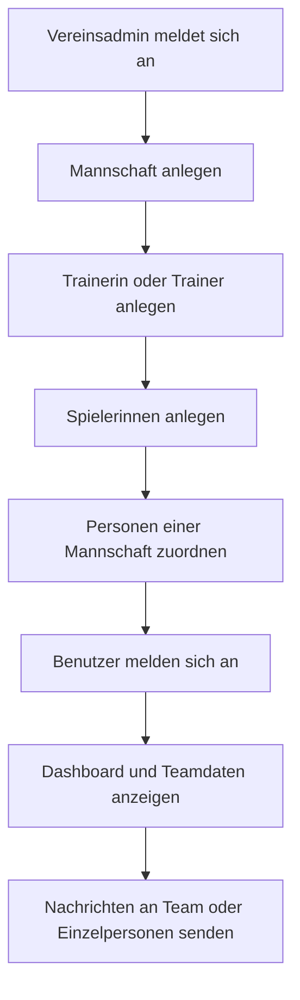

## 1. Produktüberblick
Eine webbasierte Organisationsplattform für einen Mädchenfußballverein, mit der mehrere Mannschaften, Trainerinnen/Trainer und Spielerinnen zentral verwaltet werden können.
- Das System bündelt Teamorganisation, Benutzerzugänge und vereinsinterne Kommunikation an einem Ort.
- Der Nutzen liegt in weniger Abstimmungsaufwand, klaren Zuständigkeiten und einer einfachen digitalen Vereinsstruktur.

## 2. Kernfunktionen

### 2.1 Benutzerrollen
| Rolle | Registrierungsart | Kernberechtigungen |
|------|-------------------|--------------------|
| Vereinsadmin | Anlage durch System oder Erstkonfiguration | Teams anlegen, Benutzer verwalten, Rollen zuweisen, Nachrichten einsehen, Stammdaten pflegen |
| Trainerin/Trainer | Anlage durch Vereinsadmin | Eigene Mannschaften verwalten, Spielerinnen zuweisen, teambezogene Nachrichten senden |
| Spielerin | Anlage durch Vereinsadmin oder Einladung | Eigenes Profil einsehen, Mannschaft sehen, Nachrichten lesen und senden |

### 2.2 Funktionsmodule
1. **Dashboard**: Schnellüberblick über Mannschaften, zuletzt aktive Nachrichten und Vereinsdaten.
2. **Mannschaften**: Mehrere Teams anlegen, bearbeiten, Trainerinnen/Trainer und Spielerinnen zuweisen.
3. **Benutzerverwaltung**: Trainerinnen/Trainer und Spielerinnen anlegen, Zugänge erzeugen, Rollen pflegen.
4. **Login & Profil**: Sichere Anmeldung, persönliche Startseite, Profildaten und Rollenanzeige.
5. **Nachrichtensystem**: Direktnachrichten und Team-Unterhaltungen zwischen berechtigten Vereinsmitgliedern.

### 2.3 Seitendetails
| Seitenname | Modulname | Funktionsbeschreibung |
|-----------|------------|-----------------------|
| Login | Anmeldung | Anmeldung per E-Mail und Passwort, Fehlerhinweise, Weiterleitung anhand der Rolle |
| Dashboard | Vereinsübersicht | Kennzahlen zu Mannschaften, Trainerinnen/Trainern, Spielerinnen und letzte Nachrichten |
| Mannschaften | Teamliste | Alle Mannschaften mit Altersklasse, Trainerzuordnung und Mitgliederanzahl |
| Mannschaftsdetail | Kaderverwaltung | Teamdaten bearbeiten, Trainerinnen/Trainer zuweisen, Spielerinnen hinzufügen oder entfernen |
| Benutzer | Personenverwaltung | Trainerinnen/Trainer und Spielerinnen anlegen, suchen, filtern und Rollen verwalten |
| Profil | Benutzerprofil | Eigene Stammdaten, Teamzuordnung und Kontaktinformationen |
| Nachrichten | Konversationen | Liste aller Chats, Direktnachrichten, Teamkanäle, Nachrichtenverlauf und neue Nachricht verfassen |

## 3. Kernabläufe
Der Vereinsadmin richtet zuerst den Verein und die ersten Mannschaften ein. Danach werden Trainerinnen/Trainer und Spielerinnen angelegt und den passenden Teams zugeordnet. Nach dem Login sehen Benutzer ihre für sie relevanten Daten. Über das Nachrichtensystem können Trainerinnen/Trainer mit ihren Teams kommunizieren und Vereinsmitglieder untereinander Nachrichten austauschen.

## 4. Design der Benutzeroberfläche
### 4.1 Designstil
- Primärfarben: tiefes Vereinsblau, warmes Magenta als Akzent, helle neutrale Flächen
- Button-Stil: weich gerundet, klarer Fokuszustand, deutliche Primär- und Sekundäraktionen
- Schriftbild: markante Serifenschrift für Überschriften, gut lesbare Sans-Serif für Oberflächeninhalte
- Layout-Stil: Desktop-first Dashboard mit linker Navigation, großen Inhaltskarten und klarer Informationshierarchie
- Icon-Stil: reduzierte, moderne Linien-Icons mit sportlich-dynamischer Anmutung

### 4.2 Seitenübersicht zum UI
| Seitenname | Modulname | UI-Elemente |
|-----------|------------|-------------|
| Login | Formularbereich | markante Einführungsfläche, klares Formular, Passwortfeld, Statusmeldungen |
| Dashboard | Kennzahlen | KPI-Karten, Aktivitätsliste, Schnellaktionen, Teamübersicht |
| Mannschaften | Teamverwaltung | Karten- oder Tabellenansicht, Filter, Aktionen zum Bearbeiten und Zuordnen |
| Mannschaftsdetail | Kaderbereich | Teamkopf, Trainerblock, Spielerliste, Bearbeitungsdialoge |
| Benutzer | Personenliste | Filter, Suche, Rollen-Badges, Formulare für neue Personen |
| Nachrichten | Chatansicht | Konversationsleiste, Nachrichtenverlauf, Eingabefeld, Teamkanal-Auswahl |

### 4.3 Responsivität
Desktop-first mit sauberer Anpassung für Tablets und Mobilgeräte. Navigation wird auf kleinen Bildschirmen in ein kompaktes Menü überführt, Tabellen werden in gestapelte Karten umgewandelt, und Chat sowie Formulare bleiben touch-optimiert bedienbar.
