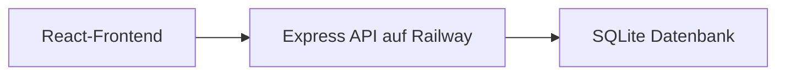
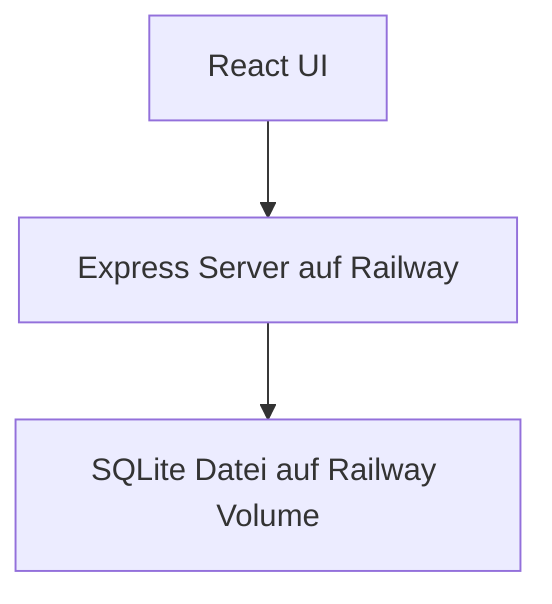
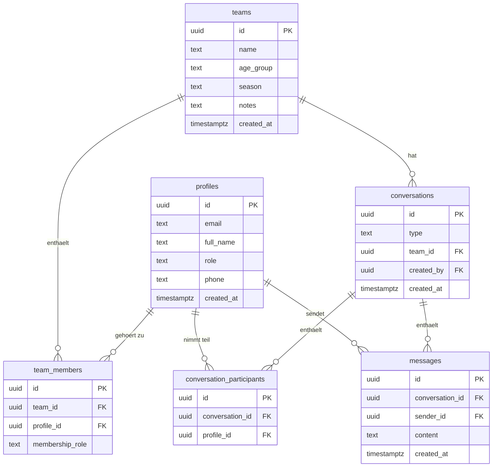

## 1. Architekturdesign



## 2. Technologiebeschreibung
- Frontend: React 18 + TypeScript + Vite
- UI: Tailwind CSS 3 + komponentenbasierte Oberfläche mit Fokus auf Dashboard-Layouts
- Backend: Express als App-Server fuer Railway
- Datenbank: SQLite ueber better-sqlite3
- Anmeldung: E-Mail/Passwort-Login mit eigener Benutzerverwaltung im Backend
- Nachrichten: klassische API-basierte Direkt- und Teamnachrichten
- Deployment: Railway fuer den App-Server und das ausgelieferte Frontend, persistente Daten ueber Railway Volume

## 3. Routendefinitionen
| Route | Zweck |
|-------|-------|
| / | Login oder Weiterleitung zum Dashboard |
| /dashboard | Startseite nach Anmeldung mit Vereinsueberblick |
| /teams | Liste aller Mannschaften |
| /teams/:teamId | Detailansicht einer Mannschaft mit Kader und Zuweisungen |
| /users | Verwaltung von Trainerinnen/Trainern und Spielerinnen |
| /messages | Zentrale Nachrichtenansicht fuer Einzel- und Teamchats |
| /profile | Eigenes Profil und Stammdaten |

## 4. API-Definitionen
Der Datenzugriff erfolgt ueber REST-Endpunkte des Express-Servers. Das Frontend arbeitet mit einem zentralen Zustandsspeicher und laedt Teams, Benutzer, Konversationen und Nachrichten ueber API-Aufrufe. Rollenpruefungen werden ueber Login-Daten, Backend-Pruefungen und Frontend-Guards abgebildet.

```ts
export type Benutzerrolle = "admin" | "trainer" | "player";

export interface Profil {
  id: string;
  email: string;
  full_name: string;
  role: Benutzerrolle;
  team_ids: string[];
  phone?: string | null;
  created_at: string;
}

export interface Team {
  id: string;
  name: string;
  age_group: string;
  season?: string | null;
  notes?: string | null;
  created_at: string;
}

export interface TeamMitglied {
  id: string;
  team_id: string;
  profile_id: string;
  membership_role: "trainer" | "player";
}

export interface Konversation {
  id: string;
  type: "direct" | "team";
  team_id?: string | null;
  created_by: string;
  created_at: string;
}

export interface KonversationTeilnehmer {
  id: string;
  conversation_id: string;
  profile_id: string;
}

export interface Nachricht {
  id: string;
  conversation_id: string;
  sender_id: string;
  content: string;
  created_at: string;
}
```

## 5. Serverarchitekturdiagramm



## 6. Datenmodell
### 6.1 Datenmodelldefinition



### 6.2 Data Definition Language

```sql
create table profiles (
  id uuid primary key,
  email text not null unique,
  full_name text not null,
  role text not null check (role in ('admin', 'trainer', 'player')),
  phone text,
  created_at timestamptz not null default now()
);

create table teams (
  id uuid primary key default gen_random_uuid(),
  name text not null,
  age_group text not null,
  season text,
  notes text,
  created_at timestamptz not null default now()
);

create table team_members (
  id uuid primary key default gen_random_uuid(),
  team_id uuid not null references teams(id) on delete cascade,
  profile_id uuid not null references profiles(id) on delete cascade,
  membership_role text not null check (membership_role in ('trainer', 'player')),
  unique (team_id, profile_id, membership_role)
);

create table conversations (
  id uuid primary key default gen_random_uuid(),
  type text not null check (type in ('direct', 'team')),
  team_id uuid references teams(id) on delete cascade,
  created_by uuid not null references profiles(id) on delete cascade,
  created_at timestamptz not null default now()
);

create table conversation_participants (
  id uuid primary key default gen_random_uuid(),
  conversation_id uuid not null references conversations(id) on delete cascade,
  profile_id uuid not null references profiles(id) on delete cascade,
  unique (conversation_id, profile_id)
);

create table messages (
  id uuid primary key default gen_random_uuid(),
  conversation_id uuid not null references conversations(id) on delete cascade,
  sender_id uuid not null references profiles(id) on delete cascade,
  content text not null,
  created_at timestamptz not null default now()
);

create index idx_team_members_team_id on team_members(team_id);
create index idx_team_members_profile_id on team_members(profile_id);
create index idx_conversations_team_id on conversations(team_id);
create index idx_messages_conversation_id on messages(conversation_id, created_at);
```
